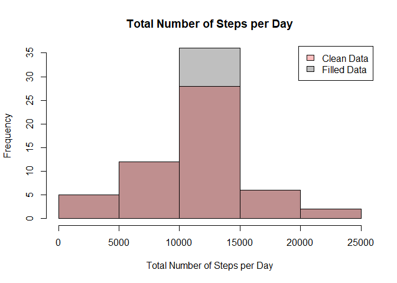

## Settings

Clean console and environment


```r
rm(list=ls())
cat("\f")
```



Set echo for knitr as True and save figures in folder

```r
library(knitr)
knitr::opts_chunk$set(echo = T)
knitr::opts_chunk$set(fig.path = "./figure/")
```

## Loading and preprocessing the data
1. Load the data (i.e. read.csv())

Download and unzip file. Read csv data.

```r
down1 <- download.file("https://d396qusza40orc.cloudfront.net/repdata%2Fdata%2Factivity.zip",
                       destfile = "./repdata_acitivity.zip")
zip1 <- unzip("./repdata_acitivity.zip",exdir = ".")
activity <- read.csv("./activity.csv")
```

2. Process/transform the data (if necessary) into a format suitable for your analysis

Remove NA values

```r
data <- na.omit(activity)
```

## What is mean total number of steps taken per day?
1. Calculate the total number of steps taken per day

Find unique dates in dataset

```r
date_vec <- unique(data$date)
```

2. If you do not understand the difference between a histogram and a barplot, research the difference between them. Make a histogram of the total number of steps taken each day

Create data frame which calculates the sum of steps taken per day

```r
date_frame = data.frame(date = character(),sum = as.numeric())

for (i in 1:length(date_vec)){
        date_frame[i,1] = date_vec[i]
        sub = data.frame()
        sub = data[data$date == date_vec[i],]
        date_frame[i,2] = sum(sub$steps)
}
```

Create histogram

```r
hist(date_frame$sum, main = "Total Number of Steps per Day",
     xlab = "Total Number of Steps per Day", ylab = "Frequency")
```

<!-- -->

3. Calculate and report the mean and median of the total number of steps taken per day

Calculate mean and median of steps per day

```r
date_mean = mean(date_frame$sum)
date_median = median(date_frame$sum)

sprintf("Steps per day average is %f and median is %f",date_mean, date_median)
```

```
## [1] "Steps per day average is 10766.188679 and median is 10765.000000"
```

## What is the average daily activity pattern?

1. Make a time series plot (i.e. type = "l"\color{red}{\verb|type = "l"|}type = "l") of the 5-minute interval (x-axis) and the average number of steps taken, averaged across all days (y-axis)

Find unique interval in dataset

```r
interval_vec <- unique(data$interval)
```
Create data frame which calculates the sum of steps taken per interval

```r
interval_frame = data.frame(interval = numeric(),mean = numeric())

for (j in 1:length(interval_vec)){
        interval_frame[j,1] = interval_vec[j]
        sub = data.frame()
        sub = data[data$interval == interval_vec[j],]
        interval_frame[j,2] = mean(sub$steps)
}
```

Create plot of steps per interval

```r
library(plotly)
```

```
## Warning: package 'plotly' was built under R version 4.0.4
```

```
## Loading required package: ggplot2
```

```
## 
## Attaching package: 'plotly'
```

```
## The following object is masked from 'package:ggplot2':
## 
##     last_plot
```

```
## The following object is masked from 'package:stats':
## 
##     filter
```

```
## The following object is masked from 'package:graphics':
## 
##     layout
```


```r
p1 <- ggplot(interval_frame, aes(x=interval_frame[,1],
                                 y=interval_frame[,2])) + geom_line()
p1 + xlab("Interval") + ylab("Average Number of Steps") + 
        ggtitle("Average Number of Steps per Interval")
```

<!-- -->

2. Which 5-minute interval, on average across all the days in the dataset, contains the maximum number of steps?

Calculate maximum steps per interval

```r
max_steps = interval_frame[which.max(interval_frame$mean),]
sprintf("Maximum steps per interval is %f at interval %f",max_steps$mean, max_steps$interval)
```

```
## [1] "Maximum steps per interval is 206.169811 at interval 835.000000"
```

## Imputing missing values
1. Calculate and report the total number of missing values in the dataset (i.e. the total number of rows with NA\color{red}{\verb|NA|}NAs)

Find all NA values is original data set and calculate number of rows with NA values

```r
data_na = activity[is.na(activity$steps),]
total_missing = nrow(data_na)
```

2. Devise a strategy for filling in all of the missing values in the dataset. The strategy does not need to be sophisticated. For example, you could use the mean/median for that day, or the mean for that 5-minute interval, etc

3. Create a new dataset that is equal to the original dataset but with the missing data filled in.

Set all NA values equal to the mean steps per specific interval

```r
for (k in 1 : nrow(data_na)){
        data_na[k,1] = interval_frame[interval_frame$interval == data_na[k,3],2]
}
```
Combine data of analysis with filled data and order it by date and interval

```r
data_all = rbind(data,data_na)
data_all = data_all[order(data_all$date,data_all$interval),]
```

Create data frame which calculates the sum of steps taken per day for the combined data set

```r
date_all_frame = data.frame(date = character(),sum = as.numeric())
date_all_vec = unique(data_all$date)

for (p in 1:length(date_all_vec)){
        date_all_frame[p,1] = date_all_vec[p]
        sub = data.frame()
        sub = data_all[data_all$date == date_all_vec[p],]
        date_all_frame[p,2] = sum(sub$steps)
}
```

4. Make a histogram of the total number of steps taken each day and Calculate and report the mean and median total number of steps taken per day. Do these values differ from the estimates from the first part of the assignment? What is the impact of imputing missing data on the estimates of the total daily number of steps?

Set colour values and create histogram of clean vs filled data

```r
col1 = rgb(1,0,0,1/4)
col2 = rgb(0,0,0,1/4)
hist(date_frame$sum,col=col1, main = "Total Number of Steps per Day",
     xlab = "Total Number of Steps per Day", ylab = "Frequency", ylim = c(0,35))
hist(date_all_frame$sum,add = T, col=col2)
legend("topright",c("Clean Data","Filled Data"), fill = c(col1,col2))
```

<!-- -->

Calculate mean and median of steps per day of filled data

```r
date_all_mean = mean(date_all_frame$sum)
date_all_median = median(date_all_frame$sum)

sprintf("Steps per day average with filled data is %f and median is %f",date_all_mean, date_all_median)
```

```
## [1] "Steps per day average with filled data is 10766.188679 and median is 10766.188679"
```

Calculate ratio of filled vs clean data for mean and median steps per day

```r
ratio_mean = date_all_mean/date_mean
ratio_median = date_all_median/date_median

sprintf("Ratio of mean steps per day of filled vs clean data is %f",ratio_mean)
```

```
## [1] "Ratio of mean steps per day of filled vs clean data is 1.000000"
```

```r
sprintf("Ratio of meadian steps per day of filled vs clean data is %f",ratio_median)
```

```
## [1] "Ratio of meadian steps per day of filled vs clean data is 1.000110"
```

## Are there differences in activity patterns between weekdays and weekends?
1. Create a new factor variable in the dataset with two levels – “weekday” and “weekend” indicating whether a given date is a weekday or weekend day.

Set system time to English and find unique intervals of filled data

```r
Sys.setlocale("LC_TIME", "English")
```


```r
interval_vec_all <- unique(data_all$interval)
```

Create data frame for weekday and weekend

```r
interval_frame_weekday = data.frame(interval = numeric(),
                                    mean = numeric(), day = character())
interval_frame_weekend = data.frame(interval = numeric(),
                                    mean = numeric(), day = character())
```

Create data frame for filled data and add row with indication of weekdays corresponding to the date column

```r
data_all_days = data_all
data_all_days[,4] = character()
names(data_all_days)[4] <- "day"
temp_days = weekdays(as.Date(data_all$date))

for (q in 1:length(temp_days)){
        if (temp_days[q] != "Saturday" &  temp_days[q] != "Sunday"){
                data_all_days[q,4] = "weekend"
        }else{
                data_all_days[q,4] = "weekday"
        }
}
```

Fill data frame weekday and weekend with their respecitve number of steps per interval

```r
for (r in 1:length(interval_vec_all)){
        interval_frame_weekday[r,1] = interval_vec_all[r]
        sub1 = data.frame()
        sub1 = data_all_days[data_all_days$interval == interval_vec[r] &
                                     data_all_days$day == "weekday",]
        interval_frame_weekday[r,2] = mean(sub1$steps)
        interval_frame_weekday[r,3] = "weekday"
}

for (s in 1:length(interval_vec_all)){
        interval_frame_weekend[s,1] = interval_vec_all[s]
        sub2 = data.frame()
        sub2 = data_all_days[data_all_days$interval == interval_vec[s] &
                                     data_all_days$day == "weekend",]
        interval_frame_weekend[s,2] = mean(sub2$steps)
        interval_frame_weekend[s,3] = "weekend"
}
```

2. Make a panel plot containing a time series plot (i.e. type = "l"\color{red}{\verb|type = "l"|}type = "l") of the 5-minute interval (x-axis) and the average number of steps taken, averaged across all weekday days or weekend days (y-axis). See the README file in the GitHub repository to see an example of what this plot should look like using simulated data.

Create data frame combining the data frames of weekday and weekend and plot the result

```r
interval_res = rbind(interval_frame_weekday,interval_frame_weekend)

p3 <- ggplot(interval_res, aes(x=interval, y=mean, group = day, colour = day)) + 
        geom_line(show.legend = F, size = 1.5) + facet_grid(rows = vars(day))
p3 + labs(title = "Total Number of Steps per Interval - Weekend vs Weekday",
                  y = "Average Number of Steps", x = "Interval")
```

<!-- -->
